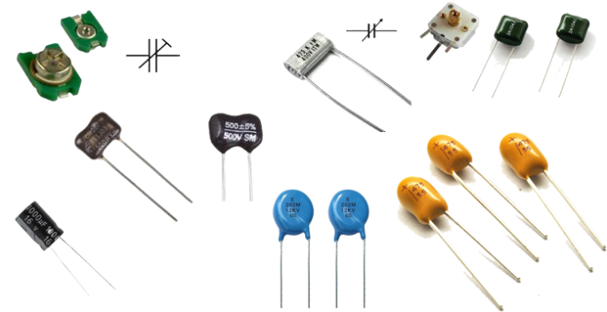
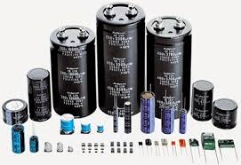

# Condensatror / Kapasitor

- [Condensatror / Kapasitor](#condensatror--kapasitor)
  - [Condensatror / Kapasitor non Polar](#condensatror--kapasitor-non-polar)
  - [Condensatror / Kapasitor Bi Polar](#condensatror--kapasitor-bi-polar)

Condensatror / Kapasitor adalah komponen elektronika yang mempunyai kemampuan menyimpan electron-elektron selama waktu yang tidak tertentu. Kapasitor berbeda dengan akumulator dalam menyimpan muatan listrik terutama tidak terjadi perubahan kimia pada bahan kapasitor, besarnya kapasitansi dari sebuah kapasitor dinyatakan dalam farad.

Condensatror / Kapasitor memiliki 2 jenis :

## Condensatror / Kapasitor non Polar
Condensatror / Kapasitor ini tidak memiliki polaritas ( tidak memiliki kutub + dan -). Jika kita memasangnya tidak terbalik tidak akan terjadi apa - apa.

## Condensatror / Kapasitor Bi Polar
Condensatror / Kapasitor ini memiliki polaritas ( memiliki kutub + dan -). Condensatror ini tidak boleh terbalik pemasangannya, jika terbalik akan terbakar / meledak

