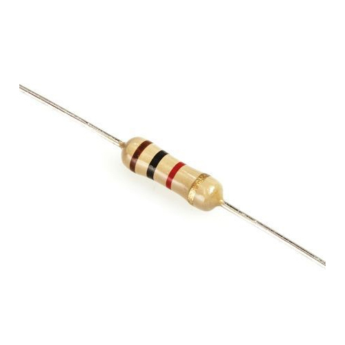

# Resistor

- [Resistor](#resistor)
  - [Resistor dengan nilai tetap](#resistor-dengan-nilai-tetap)
    - [Daftar Gelang Warna](#daftar-gelang-warna)
  - [Resistor dengan nilai berubah - ubah](#resistor-dengan-nilai-berubah---ubah)
Resistor adalah komponen elektro yang memiliki fungsi sebagai penghambat tegangan. Resistor memiliki lambang ***R*** dengan satuan ***ohm***. 

Resistor memiliki 2 jenis :

## Resistor dengan nilai tetap
Resistor ini memiliki nilai tetap. Informasi nilai dari resistornya dituliskan dalam bentuk gelang warna. 

### Daftar Gelang Warna
| Warna       | Gelang 1 | Gelang 2 | Gelang 3 (Pengali) | Gelang 4 (Toleransi) | Gelang 5 (Koefisien Suhu) |
| ----------- | :------: | :------: | :----------------: | :------------------: | :-----------------------: |
| Hitam       |    0     |    0     |  x100   |                      |                           |
| Coklat      |    1     |    1     |  x101   |   &plusmn; 1% (F)    |          100 ppm          |
| Merah       |    2     |    2     |  x102   |   &plusmn; 2% (G)    |          50 ppm           |
| Jingga      |    3     |    3     |  x103   |                      |          15 ppm           |
| Kuning      |    4     |    4     |  x104   |                      |          25 ppm           |
| Hijau       |    5     |    5     |  x105   |  &plusmn; 0.5% (D)   |                           |
| Biru        |    6     |    6     |  x106   |  &plusmn; 0.25% (C)  |                           |
| Ungu        |    7     |    7     |  x107   |  &plusmn; 0.1% (B)   |                           |
| Abu - Abu   |    8     |    8     |  x108   |  &plusmn; 0.05% (A)  |                           |
| Putih       |    9     |    9     |  x109   |                      |                           |
| Emas        |          |          |  x10-1  |   &plusmn; 5% (J)    |                           |
| Perak       |          |          |  x10-2  |   &plusmn; 10% (K)   |                           |
| Tanpa Warna |          |          |                    |   &plusmn; 20% (M)   |                           |
## Resistor dengan nilai berubah - ubah