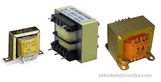

# Transformotor (Trafo)

- [Transformotor (Trafo)](#transformotor-trafo)
  - [Transformotor Step Up](#transformotor-step-up)
  - [Transformotor Step Down](#transformotor-step-down)

Transformotor berasal dari kata transfer, artinya pemindahan yaitu pemindahan tegangan AC dari jalur primer ke jalur sekunder.

Transformotor memiliki 2 jenis :

## Transformotor Step Up
Transformotor ini berfungsi untuk menaikan tegangan. biasanya digunakan jika tegangan yang dibutuhkan kurang. contoh penerapannya pada Transmisi daya listrik jarak jauh. 
## Transformotor Step Down
Transformotor ini berfungsi untuk menurunkan tegangan. biasanya digunakan jika tegangan yang dibutuhkan berlebih. contoh alat yang menggunakan trafo jenis ini adalah adaptor