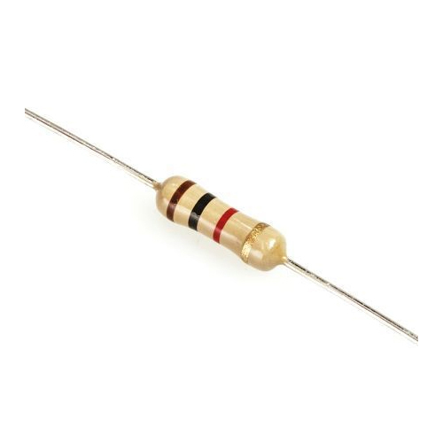

# Transistor

- [Transistor](#transistor)
  - [Resistor dengan nilai tetap](#resistor-dengan-nilai-tetap)
    - [Daftar Gelang Warna](#daftar-gelang-warna)
  - [Resistor dengan nilai berubah - ubah](#resistor-dengan-nilai-berubah---ubah)
    - [Trimpot](#trimpot)
    - [Potensiometer](#potensiometer)
    - [Resistor LDR (Light Dependent Resistor)](#resistor-ldr-light-dependent-resistor)

Transistor adalah komponen elektronika semikonduktor yang memiliki 3 kaki elektroda, yaitu Basis (Dasar), Kolektor (Pengumpul) dan Emitor (Pemancar). Komponen ini berfungsi sebagai penguat, pemutus dan penyambung (switching), stabilitasi tegangan, modulasi sinyal dan masih banyak lagi fungsi lainnya. Selain itu, transistor juga dapat digunakan sebagai kran listrik sehingga dapat mengalirkan listrik dengan sangat akurat dan sumber listriknya.

Transistor sebenarnya berasal dari kata “transfer” yang berarti pemindahan dan “resistor” yang berarti penghambat. Dari kedua kata tersebut dapat kita simpulkan, pengertian Transistor adalah pemindahan atau peralihan bahan setengah penghantar menjadi suhu tertentu.

Resistor memiliki 2 jenis :

## Resistor dengan nilai tetap
Resistor ini memiliki nilai tetap. Informasi nilai dari resistornya dituliskan dalam bentuk gelang warna. 

### Daftar Gelang Warna
| Warna       | Gelang 1 | Gelang 2 | Gelang 3 (Pengali) | Gelang 4 (Toleransi) | Gelang 5 (Koefisien Suhu) |
| ----------- | :------: | :------: | :----------------: | :------------------: | :-----------------------: |
| Hitam       |    0     |    0     |  x100   |                      |                           |
| Coklat      |    1     |    1     |  x101   |   &plusmn; 1% (F)    |          100 ppm          |
| Merah       |    2     |    2     |  x102   |   &plusmn; 2% (G)    |          50 ppm           |
| Jingga      |    3     |    3     |  x103   |                      |          15 ppm           |
| Kuning      |    4     |    4     |  x104   |                      |          25 ppm           |
| Hijau       |    5     |    5     |  x105   |  &plusmn; 0.5% (D)   |                           |
| Biru        |    6     |    6     |  x106   |  &plusmn; 0.25% (C)  |                           |
| Ungu        |    7     |    7     |  x107   |  &plusmn; 0.1% (B)   |                           |
| Abu - Abu   |    8     |    8     |  x108   |  &plusmn; 0.05% (A)  |                           |
| Putih       |    9     |    9     |  x109   |                      |                           |
| Emas        |          |          |  x10-1  |   &plusmn; 5% (J)    |                           |
| Perak       |          |          |  x10-2  |   &plusmn; 10% (K)   |                           |
| Tanpa Warna |          |          |                    |   &plusmn; 20% (M)   |                           |
## Resistor dengan nilai berubah - ubah
Resistor yang mempunyai nilai berubah - ubah biasa disebut ***Variable Resistor***. Resistor ini mempunyai banyak jenis tergantung cara penggunaannya.

### Trimpot
Trimpot adalah variable resistor kecil yang biasa digunakan pada rangkaian elektronika sebagai alat tuning.

### Potensiometer
Potensiometer adalah salah satu jenis Resistor yang Nilai Resistansinya dapat diatur sesuai dengan kebutuhan Rangkaian Elektronika ataupun kebutuhan pemakainya. Potensiometer merupakan Keluarga Resistor yang tergolong dalam Kategori Variable Resistor yang biasa digunakan sebagai pengatur Volume di peralatan Audio / Video seperti Radio, Walkie Talkie, Tape Mobil, DVD Player dan Amplifier. Potensiometer juga sering digunakan dalam Rangkaian Pengatur terang gelapnya Lampu.

### Resistor LDR (Light Dependent Resistor)
Light Dependent Resistor atau disingkat dengan LDR adalah jenis Resistor yang nilai hambatan atau nilai resistansinya tergantung pada intensitas cahaya yang diterimanya. Nilai Hambatan LDR akan menurun pada saat cahaya terang dan nilai Hambatannya akan menjadi tinggi jika dalam kondisi gelap.

